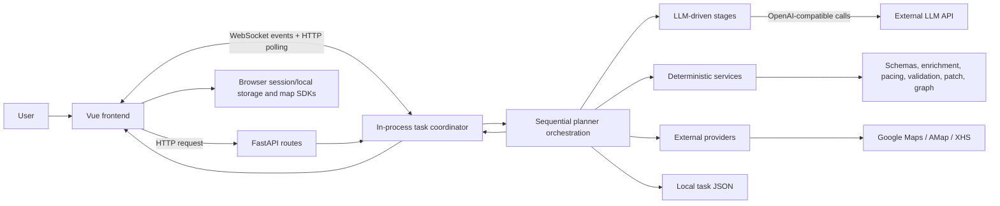

# TripStar Current Architecture

## System overview

TripStar is a Vue single-page application backed by FastAPI. The frontend collects a trip request, optionally structures free-text preferences, submits an asynchronous planning task, monitors progress, and renders the canonical backend result. The backend combines bounded LLM stages, deterministic provider adapters and policy services, local task coordination, and JSON persistence.

The boxes intentionally distinguish LLM-driven modules, deterministic services, external providers, and runtime infrastructure. Not every module is an agent.

## Frontend architecture

- `frontend/src/views/Landing.vue`: form validation, preference confirmation, generation lifecycle, progress, history/example entry.
- `frontend/src/services/api.ts`: Axios API client, runtime settings, preference/task/example/history/patch calls.
- `frontend/src/services/tripTaskLifecycle.ts`: WebSocket subscription with continuously armed status polling and refresh recovery.
- `frontend/src/views/Result.vue`: canonical task retrieval, itinerary/budget/weather/risk/evidence/map/graph rendering, photo loading, image export.
- `frontend/src/components/AIChat.vue`: separate Q&A and patch modes.
- `frontend/src/types/index.ts`: frontend contracts; Vue Router and `sessionStorage` bridge landing/result state.

## Backend architecture

- `backend/app/api/main.py`: FastAPI construction, CORS, exception sanitation, route registration, health endpoint, and static SPA serving.
- `backend/app/api/routes/`: trip, preferences, chat, POI/photo, map, settings, and example-trip endpoints.
- `backend/app/models/schemas.py`: Pydantic request/result, evidence, validation, patch, graph, and chat contracts.
- `backend/app/agents/trip_planner_agent.py`: the primary orchestration module and planner prompts.
- `backend/app/services/`: LLM compatibility/accounting, providers, enrichment, pacing, validation, revisions, patching, graph construction, chat, and public-demo guards.

## Planning and AI execution path

1. Optional free-text preference parsing makes a bounded `preference` LLM call; failure preserves explicit fields and original text.
2. `POST /api/trip/plan` fingerprints/deduplicates active semantic requests, creates/persists task state, and schedules `_run_trip_planning()`.
3. `MultiAgentTripPlanner.plan_trip()` gathers attraction research and deterministic weather/hotel context per city.
4. A fresh HelloAgents `SimpleAgent` performs the main planner call using request, provider, and pacing context.
5. Deterministic JSON cleanup is attempted; malformed output may trigger one last-resort `json_repair` LLM call. Pydantic validates the resulting `TripPlan`.
6. Deterministic map enrichment establishes trusted map fields and explicit match/source states.
7. Deterministic validation calculates budget, start-time, mobility/route, grounding, and pacing risks.
8. Eligible risks may trigger bounded LLM critic/revision or typed pacing revision. Safety gates and revalidation decide whether a revision commits; there is no unbounded autonomous loop.
9. A deterministic knowledge graph is built, the terminal result is persisted, and subscribers receive it.

Separate LLM paths support contextual Q&A and patch interpretation. Patch application, optimistic version checks, affected-day enrichment, validation, diff creation, graph rebuild, and persistence are deterministic.

## Deterministic services

- Pydantic schema validation and typed risk/patch/graph models.
- Google/AMap request adapters and provider-state classification.
- Map-fact trust boundaries and POI enrichment.
- Daily-load/pacing policy and validation.
- Budget/start-time/route/mobility/grounding validation.
- Patch operations, version/lock checks, preservation gates, and diffs.
- Task fingerprinting, persistence, progress broadcasts, public-demo concurrency/cooldown guards, and knowledge-graph construction.

## External providers

- OpenAI-compatible LLM configured by environment/runtime metadata.
- Google Places, Geocoding, Directions, Weather, Photos, and browser Maps JavaScript.
- AMap REST and browser JavaScript APIs.
- XHS HTTP research/photo adapter with local JavaScript signing support.

These are referenced and configurable. STEP 0 did not prove live credentials, quota, billing, provider permissions, freshness, or production availability.

## Async and task coordination

FastAPI returns a UUID task immediately and uses `asyncio.create_task` for planning. Process-local dictionaries hold task state, request fingerprints, subscribers, patch locks, and accounting. Each WebSocket subscriber receives events through an `asyncio.Queue`; HTTP `/status/{task_id}` is the recovery path. Semantic duplicates can reuse an active task. This design assumes one process/worker.

## Validation and grounding

LLM output is not accepted as authoritative map data. Map enrichment strips or replaces untrusted coordinates/provider facts. `TripValidatorService` emits typed risks and degraded states. XHS models preserve evidence identifiers, quotes, and support links; photo responses identify provider and attribution where available. Grounding remains partial because many generated descriptions and cost/recommendation fields have no uniform source citation.

## Frontend-backend communication

- HTTP: preference parsing, task submission/status/history, chat, patch, maps/POIs/photos, settings, and example trip.
- WebSocket: task progress and terminal response.
- Frontend recovery: polling remains armed and takes over after WebSocket failure/early close; persisted task IDs allow refresh recovery.
- Deployment mode: same-origin Vue static assets and `/api` endpoints; Vite proxies `/api` to port 8000 in development.

## Persistence and state model

Terminal/in-progress task snapshots are written to `backend/data/trip_tasks/*.json` with free-form preference text sanitized from the persisted request payload. Docker Compose mounts this directory through a named volume. Browser state uses `sessionStorage` and browser-safe runtime settings use `localStorage`/`backend/runtime_settings.json`. There is no database schema, migration system, user ownership model, retention policy, shared lock, or durable queue.

## Deployment model

The multi-stage `Dockerfile` builds Vue with Node 18 and runs FastAPI from Python 3.10 with Gunicorn and one Uvicorn worker. `start.sh` binds the platform `PORT`; Compose defaults to port 7860 and a task-data volume. `/health` reports process/configuration metadata but does not probe providers or storage. This is deployment configuration, not evidence that production exists or is healthy.

## Failure and recovery behavior

- Preference parsing fails open to explicit preferences.
- Provider adapters classify errors and commonly degrade rather than fabricate verified results.
- LLM retries are limited to classified transient failures; planner timeout has one application retry; logical calls are budgeted.
- Unsafe/invalid revisions are rejected while retaining the prior candidate.
- Public mode sanitizes request/provider errors.
- Unfinished persisted tasks become failed after process restart; execution is not resumed.
- WebSocket loss falls back to polling; missing tasks and terminal failures are surfaced to the UI.

## Architectural limitations

- Sequential, bounded agent-assisted orchestration—not autonomous multi-agent execution.
- Single-process coordination prevents safe multi-worker/horizontal operation.
- No authentication/authorization, database, distributed cache, broker, durable worker, cancellation, or restart resume.
- Partial grounding and no booking/live inventory or authoritative price feed.
- Large central frontend/backend modules and fragile mixed test import paths.
- No verified live deployment or full browser E2E coverage.
